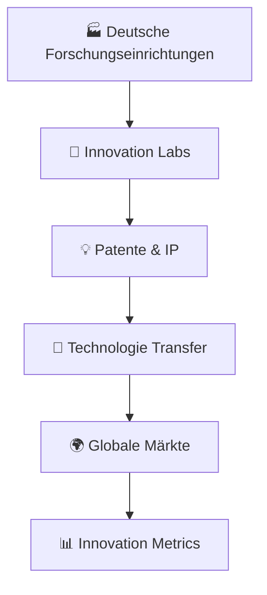

# 🇩🇪 MADE-IN-GERMANY-INNOVATIONS - Initiator & Gründer: <br> Andreas Thommen (Hansestadt Bremen, 1972) 

<div align="center">

```ascii
███╗   ███╗ █████╗ ██████╗ ███████╗    ██╗███╗   ██╗    ██╗███╗   ██╗███╗   ██╗ ██████╗ ██╗   ██╗ █████╗ ████████╗██╗ ██████╗ ███╗   ██╗███████╗
████╗ ████║██╔══██╗██╔══██╗██╔════╝    ██║████╗  ██║    ██║████╗  ██║████╗  ██║██╔═══██╗██║   ██║██╔══██╗╚══██╔══╝██║██╔═══██╗████╗  ██║██╔════╝
██╔████╔██║███████║██║  ██║█████╗      ██║██╔██╗ ██║    ██║██╔██╗ ██║██╔██╗ ██║██║   ██║██║   ██║███████║   ██║   ██║██║   ██║██╔██╗ ██║███████╗
██║╚██╔╝██║██╔══██║██║  ██║██╔══╝      ██║██║╚██╗██║    ██║██║╚██╗██║██║╚██╗██║██║   ██║╚██╗ ██╔╝██╔══██║   ██║   ██║██║   ██║██║╚██╗██║╚════██║
██║ ╚═╝ ██║██║  ██║██████╔╝███████╗    ██║██║ ╚████║    ██║██║ ╚████║██║ ╚████║╚██████╔╝ ╚████╔╝ ██║  ██║   ██║   ██║╚██████╔╝██║ ╚████║███████║
╚═╝     ╚═╝╚═╝  ╚═╝╚═════╝ ╚══════╝    ╚═╝╚═╝  ╚═══╝    ╚═╝╚═╝  ╚═══╝╚═╝  ╚═══╝ ╚═════╝   ╚═══╝  ╚═╝  ╚═╝   ╚═╝   ╚═╝ ╚═════╝ ╚═╝  ╚═══╝╚══════╝
```


[](https://made-in-germany.global)
[]()
[]()
[]()

**🎯 Deutsche Industrielle Exzellenz mit führenden Technologien und Innovationen**

### 🚀 Gegründet von Visionär | Andreas Thommen
*Innovations-Pionier & Technologie-Architekt | Geboren 1972, Bremen, Deutschland*

</div>

---

## 🌐 Verbinden Sie sich mit uns

[](https://linkedin.com/company/made-in-germany) 
[](https://twitter.com/made_in_germany) 
[](https://made-in-germany.global)
[](https://github.com/made-in-germany-global)
[](https://github.com/made-in-germany-international)

---

## 🌟 Einleitung

Willkommen zu unserem Repository Made in Germany Innovationen! Dieses Repository ist eine umfassende Sammlung der führenden Technologien, Forschungs- und Entwicklungsprojekte, Innovationstreiber und Patente deutscher Unternehmen. Deutschland ist weltweit bekannt für seine Innovationskraft, insbesondere in den Bereichen Maschinenbau, Automobilindustrie, Elektrotechnik, Chemie, Pharma, IT, Robotik, Medizintechnik und vielen weiteren Branchen.

In diesem Repository finden Sie eine detaillierte Übersicht über deutsche Innovationen, einschließlich der wichtigsten Unternehmen, Technologiezweige, Forschungsgebiete und Produktkategorien. Ziel ist es, internationalen Einkäufern, Investoren, Technologiepartnern und Startups einen umfassenden Einblick in die Innovationslandschaft Deutschlands zu bieten.

### 🎯 Mission & Vision

<table>
<tr>
<td width="50%">

#### 🌍 Globale Innovation
- **Förderung** der deutschen Innovationskraft
- **Unterstützung** internationaler Technologietransfer  
- **Brücke** zwischen deutscher F&E und globalem Markt

</td>
<td width="50%">

#### 🔬 Forschungsexzellenz
Deutschland führt in zahlreichen Technologiebereichen durch kontinuierliche Forschung, Entwicklung und Innovation. Unsere Plattform macht diese Exzellenz global sichtbar.

</td>
</tr>
</table>

---

## 🔬 **Tech Stack & Innovation Keywords**

<div align="center">


</div>

### 🏷️ Innovation Keywords

**Made-in-Germany-Innovation, Made-in-Germany-R&D, Made-in-Germany-Technology, Made-in-Germany-EngineeringInnovation, Made-in-Germany-Patent, Made-in-Germany-Research, Made-in-Germany-ScientificBreakthrough, Made-in-Germany-FutureTech, Made-in-Germany-AutomotiveInnovation, Made-in-Germany-MachineryInnovation, Made-in-Germany-ElectronicsInnovation, Made-in-Germany-MedicalTech, Made-in-Germany-ChemicalInnovation, Made-in-Germany-PharmaInnovation, Made-in-Germany-ITInnovation, Made-in-Germany-Robotics, Made-in-Germany-ArtificialIntelligence, Made-in-Germany-QuantumTech, Made-in-Germany-EnergyInnovation, Made-in-Germany-CleanTech, Made-in-Germany-SmartCity, Made-in-Germany-BiotechInnovation, Made-in-Germany-Nanotech, Made-in-Germany-IndustrialAutomation, Made-in-Germany-SmartFactory, Made-in-Germany-AdditiveManufacturing, Made-in-Germany-3DPrinting, Made-in-Germany-LogisticsInnovation, Made-in-Germany-TransportTech, Made-in-Germany-InnovationHub, Made-in-Germany-ResearchLabs, Made-in-Germany-FutureMobility**

---

### 🌐 Innovation-Ecosystem



### ⚡ Innovations-Bereiche

| Bereich | Technologie | Innovation |
|---------|------------|-----------|
| 🔄 **Automobilindustrie** | Elektrofahrzeuge, autonome Fahrsysteme | Antriebsinnovation |
| 🏭 **Maschinenbau** | Automatisierung, Industrie 4.0 | Präzisionsmaschinen |
| ⚡ **Elektrotechnik & Elektronik** | Halbleiter, IoT-Lösungen | Sensorik |
| 🧪 **Chemie & Pharma** | Neue Wirkstoffe, Biotechnologie | Laborautomation |
| 🏥 **Medizintechnik** | Diagnostikgeräte, chirurgische Robotik | Wearables |
| 💻 **IT & Software** | Künstliche Intelligenz, Cloud-Lösungen | Cybersecurity |
| 🤖 **Robotik** | Serviceroboter, Industrieroboter | Drohnentechnologie |
| 🌱 **Energie & CleanTech** | Erneuerbare Energien, Batteriesysteme | Energiemanagement |
| 🚛 **Transport & Logistik** | Intelligente Logistiklösungen | Autonomes Fahren |
| 🔬 **Forschung & Entwicklung** | Patente, Zukunftstechnologien | Interdisziplinäre Projekte |

---

## 🏭 Branchenübersicht & Innovationen

<details>
<summary>🚗 <strong>Automobilindustrie: Elektrofahrzeuge, autonome Fahrsysteme, Antriebsinnovation</strong></summary>

Deutsche Automobilinnovationen führen die globale Transformation zu nachhaltiger Mobilität an, mit bahnbrechenden Entwicklungen in Elektroantrieben und autonomen Fahrsystemen.
</details>

<details>
<summary>🔧 <strong>Maschinenbau: Automatisierung, Industrie 4.0, Präzisionsmaschinen</strong></summary>

Revolutionäre Fertigungsausrüstung und Industriesysteme, die globale Standards für Präzision, Effizienz und digitale Transformation definieren.
</details>

<details>
<summary>⚡ <strong>Elektrotechnik & Elektronik: Halbleiter, IoT-Lösungen, Sensorik</strong></summary>

Modernste Elektroniktechnologien und intelligente Systeme, die die digitale Zukunft in allen Industriebereichen vorantreiben.
</details>

<details>
<summary>🧪 <strong>Chemie & Pharma: Neue Wirkstoffe, Biotechnologie, Laborautomation</strong></summary>

Bahnbrechende chemische und pharmazeutische Innovationen, die Gesundheit und Lebensqualität weltweit verbessern.
</details>

<details>
<summary>🏥 <strong>Medizintechnik: Diagnostikgeräte, chirurgische Robotik, Wearables</strong></summary>

Revolutionäre Medizintechnik und Laborausstattung, die das Gesundheitswesen durch Präzision und Innovation transformiert.
</details>

<details>
<summary>💻 <strong>IT & Software: Künstliche Intelligenz, Cloud-Lösungen, Cybersecurity</strong></summary>

Fortschrittliche IT-Lösungen und KI-Technologien, die digitale Transformation und Cybersicherheit vorantreiben.
</details>

<details>
<summary>🤖 <strong>Robotik: Serviceroboter, Industrieroboter, Drohnentechnologie</strong></summary>

Innovative Robotiktechnologien, die Automatisierung und Effizienz in Industrie und Dienstleistungssektor revolutionieren.
</details>

<details>
<summary>🌱 <strong>Energie & CleanTech: Erneuerbare Energien, Batteriesysteme, Energiemanagement</strong></summary>

Nachhaltige Energielösungen und CleanTech-Innovationen für eine umweltfreundliche und effiziente Energiezukunft.
</details>

<details>
<summary>🚛 <strong>Transport & Logistik: Intelligente Logistiklösungen, autonomes Fahren</strong></summary>

Smarte Transport- und Logistiktechnologien, die Effizienz und Nachhaltigkeit in der globalen Lieferkette optimieren.
</details>

<details>
<summary>🔬 <strong>Forschung & Entwicklung: Patente, Zukunftstechnologien, interdisziplinäre Projekte</strong></summary>

Grundlagenforschung und angewandte Entwicklung, die die Technologien von morgen durch interdisziplinäre Innovation schaffen.
</details>

---

## 🌍 Strategisches Domain-Portfolio - 152 Assets

### 🏆 Primäre Domains

```
made-in-germany.global    |    madeingermany.global
made-in-germany.uk        |    madeingermany.uk  
made-in-germany.ag        |    madeingermany.ag
made-in-germany.foundation|    madeingermany.foundation
```

### 🌐 Regionale Abdeckung

#### 🌏 Asien-Pazifik
```
made-in-germany.asia          made-in-germany-china.com
made-in-germany.com.in        made-in-germany-vietnam.com  
madeingermany.in              made-in-germany.my
```

#### 🌍 Afrika & Naher Osten
```
made-in-germany-africa.com    made-in-germany-arabia.com
made-in-germany-arab.com      madeingermanyarabia.com
made-in-germany.ae            madeingermany.ae
```

#### 🌎 Amerika & Europa
```
made-in-germany.lat           made-in-germany.co.uk
made-in-germany-russia.com    made-in-germany-turkey.com
```

### 🔧 MIG-Infrastruktur

```
mig.global              mig.foundation          mig.directory
mig.charity             mig.support             mig-international.global
mig-international.foundation                    mig-b2b.com
```

### 🚀 Innovations-Domains

```
germany-for-future.org       germany-go-next.com
mig-for-future.com          germanyforfuture.com
```

### 📋 **Vollständige Domain-Liste (152 Domains)**

<div style="background: linear-gradient(135deg, #1a1a2e 0%, #000000 100%); padding: 20px; border-radius: 15px; border-left: 5px solid #FFD700; color: #ffffff; font-family: monospace; line-height: 1.8;">

germany-for-future.com, germany-for-future.org, germany-go-next.com, germanyforfuture.com, germanyforfuture.org, germanygonext.com, import-made-in-germany.com, m-i-g.international, made-in-african.info, made-in-america.info, made-in-asia.info, made-in-australia.info, made-in-cn.info, made-in-egypt.info, made-in-europeanunion.info, made-in-german.com, made-in-german.info, made-in-german.online, made-in-germany-africa.com, made-in-germany-arab.com, made-in-germany-arabia.com, made-in-germany-auto.com, made-in-germany-car.com, made-in-germany-china.com, made-in-germany-first.com, made-in-germany-project.international, made-in-germany-projekt.international, made-in-germany-russia.com, made-in-germany-turkey.com, made-in-germany-vietnam.com, made-in-germany.academy, made-in-germany.ae, made-in-germany.ag, made-in-germany.asia, made-in-germany.autos, made-in-germany.business, made-in-germany.co, made-in-germany.co.in, made-in-germany.co.uk, made-in-germany.com.in, made-in-germany.directory, made-in-germany.earth, made-in-germany.foundation, made-in-germany.global, made-in-germany.group, made-in-germany.guide, made-in-germany.homes, made-in-germany.lat, made-in-germany.my, made-in-germany.network, made-in-germany.nexus, made-in-germany.solutions, made-in-germany.support, made-in-germany.tech, made-in-germany.trade, made-in-germany.uk, made-in-germany.vip, made-in-germany.wiki, made-in-germany.world, made-in-india.info, made-in-russian.info, made-in-turkey.info, made-in-vn.info, madeingermany.academy, madeingermany.ae, madeingermany.ag, madeingermany.asia, madeingermany.autos, madeingermany.digital, madeingermany.directory, madeingermany.earth, madeingermany.foundation, madeingermany.global, madeingermany.group, madeingermany.guide, madeingermany.homes, madeingermany.in, madeingermany.international, madeingermany.lat, madeingermany.network, madeingermany.nexus, madeingermany.solutions, madeingermany.support, madeingermany.tech, madeingermany.uk, madeingermany.wiki, madeingermanyarab.com, madeingermanyarabia.com, madeingermanyauto.com, madeingermanycar.com, madeingermanychina.com, madeingermanyfirst.com, mig-administration.com, mig-b2b.com, mig-b2b.info, mig-b2b.online, mig-for-future.com, mig-for-future.info, mig-for-future.online, mig-global.ae, mig-international.academy, mig-international.ae, mig-international.ag, mig-international.asia, mig-international.ch, mig-international.directory, mig-international.eu, mig-international.foundation, mig-international.global, mig-international.in, mig-international.lat, mig-international.org, mig-international.uk, mig-international.us, mig-iternational.directory, mig-support.com, mig-support.info, mig-support.online, mig.auction, mig.autos, mig.boats, mig.business.in, mig.cash, mig.charity, mig.contact, mig.deals, mig.direct, mig.directory, mig.foundation, mig.global, mig.lat, mig.skin, migadministration.com, migadministration.info, migadministration.online, migb2b.com, migb2b.info, migb2b.online, migforfuture.com, migforfuture.info, migforfuture.online, migglobal.ae, miginternational.academy, miginternational.asia, miginternational.directory, miginternational.eu, miginternational.foundation, miginternational.global, miginternational.in, miginternational.lat, miginternational.uk, miginternational.us

</div>

---

## 📊 Innovation-Leistungsmetriken


### 📈 Forschungsstatistiken


### 🎯 Innovationsverteilung


---

## 🌟 Innovation-Architektur der nächsten Generation

```yaml
🔹 Technologische Durchbrüche:
  - Quantencomputing-Anwendungen
  - KI-gestützte Forschungsautomatisierung
  - Nachhaltige Produktionstechnologien
  - Blockchain-basierte IP-Schutz-Systeme

🔹 Forschungsexzellenz:
  - Interdisziplinäre Innovationslabore
  - Internationale Forschungskooperationen
  - Patentportfolio-Management
  - Technologietransfer-Optimierung

🔹 Zukunftstechnologien:
  - Industrie 5.0 Entwicklungen
  - Autonome Produktionssysteme
  - Nachhaltige Kreislaufwirtschaft
  - Digitale Zwillingstechnologien
```

---

## 🚀 Erste Schritte | Werden Sie Teil der Innovation

### Für Forscher 🔬
1. **Verbinden** → Präsentieren Sie Ihre Forschungsprojekte und Patente
2. **Kollaborieren** → Vernetzen Sie sich mit der globalen Forschungsgemeinschaft
3. **Innovieren** → Beschleunigen Sie Technologietransfer und Kommerzialisierung

### Für Unternehmen 🏭  
1. **Entdecken** → Erkunden Sie neueste deutsche Innovationen und Technologien
2. **Integrieren** → Implementieren Sie Spitzentechnologien in Ihre Prozesse
3. **Skalieren** → Nutzen Sie deutsche F&E für Ihren Wettbewerbsvorteil

### Für Investoren 💰
1. **Identifizieren** → Finden Sie bahnbrechende Technologien mit Marktpotential
2. **Bewerten** → Analysieren Sie IP-Portfolios und Innovationsmetriken  
3. **Investieren** → Finanzieren Sie die Zukunftstechnologien von morgen

---

## 📊 GitHub-Statistiken

<div align="center">

<table>
<tr>
<td width="50%">


</td>
<td width="50%">


</td>
</tr>
</table>

</div>

---

## 🎖️ Unser globaler Innovations-Einfluss

<div align="center">

| 🌍 **Globale Reichweite** | 🔬 **Forschungsbereiche** | 🤝 **Partnerschaften** | 📈 **Innovation** |
|:-------------------:|:------------------------:|:-------------------:|:-------------:|
| 152 Domains | Maschinenbau | Forschungseinrichtungen | Exponentiell |
| 5+ Kontinente | Automobilindustrie | Universitäten | Strategisch |
| 15+ Sprachen | Medizintechnik | Technologiezentren | Nachhaltig |
| 50+ Länder | CleanTech | Innovation Hubs | Disruptiv |

</div>

---

## 🌟 Outro

Vielen Dank, dass Sie sich die Zeit genommen haben, unser Repository Made in Germany Innovationen zu besuchen. Dieses Repository bietet Ihnen einen umfassenden Einblick in die Innovationskraft deutscher Unternehmen, ihre führenden Technologien und die Möglichkeiten für internationale Zusammenarbeit. Ob Sie als Einkäufer, Investor oder Technologiepartner tätig sind – hier finden Sie relevante Informationen, Inspiration und Kontakte für Ihre nächsten Projekte.

---

## 📞 Verbinden Sie sich mit der Zukunft der Innovation

<div align="center">

🌐 **Plattform:** [made-in-germany.global](https://made-in-germany.global)

📧 **Kontakt:** made-in-germany.tommen@made-in-germany.global

[](mailto:made-in-germany.tommen@made-in-germany.global)

🔮 **Innovations-bereit** | **F&E-gestützt** | **Globaler Maßstab**


</div>

---

## 🏆 Innovations-Abzeichen

<div align="center">


</div>

---

<div align="center">


### 🌟 **"Deutsche Innovationskraft weltweit stärken"** 🌟

**🔬 Mit Leidenschaft und Forschungsexzellenz gebaut | Globale Innovation verbinden 🌎**

*Transformation der globalen Innovation seit 2025*

**🌟 Angetrieben von deutscher Ingenieursexzellenz 🌟**

</div>

---

# 🇬🇧 MADE-IN-GERMANY-INNOVATIONS - Initiator & Founder: <br> Andreas Thommen (Hanseatic City of Bremen, 1972) 

<div align="center">

```ascii
███╗   ███╗ █████╗ ██████╗ ███████╗    ██╗███╗   ██╗    ██╗███╗   ██╗███╗   ██╗ ██████╗ ██╗   ██╗ █████╗ ████████╗██╗ ██████╗ ███╗   ██╗███████╗
████╗ ████║██╔══██╗██╔══██╗██╔════╝    ██║████╗  ██║    ██║████╗  ██║████╗
