# 🇩🇪 MADE-IN-GERMANY-INNOVATIONS - Initiator & Gründer: <br> Andreas Thommen (Hansestadt Bremen, 1972) 

<div align="center">

```ascii
███╗   ███╗ █████╗ ██████╗ ███████╗    ██╗███╗   ██╗     ██████╗ ███████╗██████╗ ███╗   ███╗ █████╗ ███╗   ██╗██╗   ██╗
████╗ ████║██╔══██╗██╔══██╗██╔════╝    ██║████╗  ██║    ██╔════╝ ██╔════╝██╔══██╗████╗ ████║██╔══██╗████╗  ██║╚██╗ ██╔╝
██╔████╔██║███████║██║  ██║█████╗      ██║██╔██╗ ██║    ██║  ███╗█████╗  ██████╔╝██╔████╔██║███████║██╔██╗ ██║ ╚████╔╝
██║╚██╔╝██║██╔══██║██║  ██║██╔══╝      ██║██║╚██╗██║    ██║   ██║██╔══╝  ██╔══██╗██║╚██╔╝██║██╔══██║██║╚██╗██║  ╚██╔╝ 
██║ ╚═╝ ██║██║  ██║██████╔╝███████╗    ██║██║ ╚████║    ╚██████╔╝███████╗██║  ██║██║ ╚═╝ ██║██║  ██║██║ ╚████║   ██║   
╚═╝     ╚═╝╚═╝  ╚═╝╚═════╝ ╚══════╝    ╚═╝╚═╝  ╚═══╝     ╚═════╝ ╚══════╝╚═╝  ╚═╝╚═╝     ╚═╝╚═╝  ╚═╝╚═╝  ╚═══╝   ╚═╝   
```


[](https://made-in-germany.global)
[]()
[]()
[]()

**🎯 Deutsche Industrielle Exzellenz mit führenden Technologien und Innovationen**

### 🚀 Gegründet von Visionär | Andreas Thommen
*Innovations-Pionier & Technologie-Architekt | Geboren 1972, Bremen, Deutschland*

</div>

---

## 🌐 Verbinden Sie sich mit uns

[](https://linkedin.com/company/made-in-germany) 
[](https://twitter.com/made_in_germany) 
[](https://made-in-germany.global)
[](https://github.com/made-in-germany-global)
[](https://github.com/made-in-germany-international)

---

## 🌟 Willkommen bei Made in Germany – Innovationen

Hier dreht sich alles um technologische Spitzenleistungen, kreative Lösungen und innovative Entwicklungen aus Deutschland. Wir präsentieren Projekte, Produkte und Ideen, die für Qualität, Präzision und Fortschritt stehen und weltweit Maßstäbe setzen.

Entdecken Sie Innovation in Maschinenbau, Medizintechnik, Hightech, Energie- und Umwelttechnologien, Automobilbau und Digitalisierung. Unser Fokus liegt darauf, deutsche Exzellenz international sichtbar zu machen und Fortschritt und Effizienz in globale Märkte zu tragen.

Bei Made in Germany – Innovationen erleben Sie, wie Forschung, Entwicklung und kreative Technologien zusammenkommen, um zukunftsweisende Lösungen für Industrie, Wirtschaft und Gesellschaft zu schaffen. Werden Sie Teil unserer Mission, deutsche Innovationskraft weltweit zu fördern und nachhaltige, zukunftsorientierte Projekte voranzutreiben.


### 🎯 Mission & Vision

<table>
<tr>
<td width="50%">

#### 🌍 Globale Innovation
- **Förderung** der deutschen Innovationskraft
- **Unterstützung** internationaler Technologietransfer  
- **Brücke** zwischen deutscher F&E und globalem Markt

</td>
<td width="50%">

#### 🔬 Forschungsexzellenz
Deutschland führt in zahlreichen Technologiebereichen durch kontinuierliche Forschung, Entwicklung und Innovation. Unsere Plattform macht diese Exzellenz global sichtbar.

</td>
</tr>
</table>

---

## 🔬 **Tech Stack & Innovation Keywords**

<div align="center">


</div>

### 🏷️ Innovation Keywords

**Made-in-Germany-Innovation, Made-in-Germany-R&D, Made-in-Germany-Technology, Made-in-Germany-EngineeringInnovation, Made-in-Germany-Patent, Made-in-Germany-Research, Made-in-Germany-ScientificBreakthrough, Made-in-Germany-FutureTech, Made-in-Germany-AutomotiveInnovation, Made-in-Germany-MachineryInnovation, Made-in-Germany-ElectronicsInnovation, Made-in-Germany-MedicalTech, Made-in-Germany-ChemicalInnovation, Made-in-Germany-PharmaInnovation, Made-in-Germany-ITInnovation, Made-in-Germany-Robotics, Made-in-Germany-ArtificialIntelligence, Made-in-Germany-QuantumTech, Made-in-Germany-EnergyInnovation, Made-in-Germany-CleanTech, Made-in-Germany-SmartCity, Made-in-Germany-BiotechInnovation, Made-in-Germany-Nanotech, Made-in-Germany-IndustrialAutomation, Made-in-Germany-SmartFactory, Made-in-Germany-AdditiveManufacturing, Made-in-Germany-3DPrinting, Made-in-Germany-LogisticsInnovation, Made-in-Germany-TransportTech, Made-in-Germany-InnovationHub, Made-in-Germany-ResearchLabs, Made-in-Germany-FutureMobility**

---

### 🌐 Innovation-Ecosystem

```mermaid
graph TB
    A[🏭 Deutsche Forschungseinrichtungen] --> B[🔬 Innovation Labs]
    B --> C[💡 Patente & IP]
    C --> D[🚀 Technologie Transfer]
    D --> E[🌍 Globale Märkte]
    E --> F[📊 Innovation Metrics]
```



### ⚡ Innovations-Bereiche

| Bereich | Technologie | Innovation |
|---------|------------|-----------|
| 🔄 **Automobilindustrie** | Elektrofahrzeuge, autonome Fahrsysteme | Antriebsinnovation |
| 🏭 **Maschinenbau** | Automatisierung, Industrie 4.0 | Präzisionsmaschinen |
| ⚡ **Elektrotechnik & Elektronik** | Halbleiter, IoT-Lösungen | Sensorik |
| 🧪 **Chemie & Pharma** | Neue Wirkstoffe, Biotechnologie | Laborautomation |
| 🏥 **Medizintechnik** | Diagnostikgeräte, chirurgische Robotik | Wearables |
| 💻 **IT & Software** | Künstliche Intelligenz, Cloud-Lösungen | Cybersecurity |
| 🤖 **Robotik** | Serviceroboter, Industrieroboter | Drohnentechnologie |
| 🌱 **Energie & CleanTech** | Erneuerbare Energien, Batteriesysteme | Energiemanagement |
| 🚛 **Transport & Logistik** | Intelligente Logistiklösungen | Autonomes Fahren |
| 🔬 **Forschung & Entwicklung** | Patente, Zukunftstechnologien | Interdisziplinäre Projekte |

---

## 🏭 Branchenübersicht & Innovationen

<details>
<summary>🚗 <strong>Automobilindustrie: Elektrofahrzeuge, autonome Fahrsysteme, Antriebsinnovation</strong></summary>

Deutsche Automobilinnovationen führen die globale Transformation zu nachhaltiger Mobilität an, mit bahnbrechenden Entwicklungen in Elektroantrieben und autonomen Fahrsystemen.
</details>

<details>
<summary>🔧 <strong>Maschinenbau: Automatisierung, Industrie 4.0, Präzisionsmaschinen</strong></summary>

Revolutionäre Fertigungsausrüstung und Industriesysteme, die globale Standards für Präzision, Effizienz und digitale Transformation definieren.
</details>

<details>
<summary>⚡ <strong>Elektrotechnik & Elektronik: Halbleiter, IoT-Lösungen, Sensorik</strong></summary>

Modernste Elektroniktechnologien und intelligente Systeme, die die digitale Zukunft in allen Industriebereichen vorantreiben.
</details>

<details>
<summary>🧪 <strong>Chemie & Pharma: Neue Wirkstoffe, Biotechnologie, Laborautomation</strong></summary>

Bahnbrechende chemische und pharmazeutische Innovationen, die Gesundheit und Lebensqualität weltweit verbessern.
</details>

<details>
<summary>🏥 <strong>Medizintechnik: Diagnostikgeräte, chirurgische Robotik, Wearables</strong></summary>

Revolutionäre Medizintechnik und Laborausstattung, die das Gesundheitswesen durch Präzision und Innovation transformiert.
</details>

<details>
<summary>💻 <strong>IT & Software: Künstliche Intelligenz, Cloud-Lösungen, Cybersecurity</strong></summary>

Fortschrittliche IT-Lösungen und KI-Technologien, die digitale Transformation und Cybersicherheit vorantreiben.
</details>

<details>
<summary>🤖 <strong>Robotik: Serviceroboter, Industrieroboter, Drohnentechnologie</strong></summary>

Innovative Robotiktechnologien, die Automatisierung und Effizienz in Industrie und Dienstleistungssektor revolutionieren.
</details>

<details>
<summary>🌱 <strong>Energie & CleanTech: Erneuerbare Energien, Batteriesysteme, Energiemanagement</strong></summary>

Nachhaltige Energielösungen und CleanTech-Innovationen für eine umweltfreundliche und effiziente Energiezukunft.
</details>

<details>
<summary>🚛 <strong>Transport & Logistik: Intelligente Logistiklösungen, autonomes Fahren</strong></summary>

Smarte Transport- und Logistiktechnologien, die Effizienz und Nachhaltigkeit in der globalen Lieferkette optimieren.
</details>

<details>
<summary>🔬 <strong>Forschung & Entwicklung: Patente, Zukunftstechnologien, interdisziplinäre Projekte</strong></summary>

Grundlagenforschung und angewandte Entwicklung, die die Technologien von morgen durch interdisziplinäre Innovation schaffen.
</details>

---

## 🌍 Strategisches Domain-Portfolio - 152 Assets

### 🏆 Primäre Domains

```
made-in-germany.global    |    madeingermany.global
made-in-germany.uk        |    madeingermany.uk  
made-in-germany.ag        |    madeingermany.ag
made-in-germany.foundation|    madeingermany.foundation
```

### 🌐 Regionale Abdeckung

#### 🌏 Asien-Pazifik
```
made-in-germany.asia          made-in-germany-china.com
made-in-germany.com.in        made-in-germany-vietnam.com  
madeingermany.in              made-in-germany.my
```

#### 🌍 Afrika & Naher Osten
```
made-in-germany-africa.com    made-in-germany-arabia.com
made-in-germany-arab.com      madeingermanyarabia.com
made-in-germany.ae            madeingermany.ae
```

#### 🌎 Amerika & Europa
```
made-in-germany.lat           made-in-germany.co.uk
made-in-germany-russia.com    made-in-germany-turkey.com
```

### 🔧 MIG-Infrastruktur

```
mig.global              mig.foundation          mig.directory
mig.charity             mig.support             mig-international.global
mig-international.foundation                    mig-b2b.com
```

### 🚀 Innovations-Domains

```
germany-for-future.org       germany-go-next.com
mig-for-future.com          germanyforfuture.com
```

### 📋 **Vollständige Domain-Liste (152 Domains)**

<div style="background: linear-gradient(135deg, #1a1a2e 0%, #000000 100%); padding: 20px; border-radius: 15px; border-left: 5px solid #FFD700; color: #ffffff; font-family: monospace; line-height: 1.8;">

germany-for-future.com, germany-for-future.org, germany-go-next.com, germanyforfuture.com, germanyforfuture.org, germanygonext.com, import-made-in-germany.com, m-i-g.international, made-in-african.info, made-in-america.info, made-in-asia.info, made-in-australia.info, made-in-cn.info, made-in-egypt.info, made-in-europeanunion.info, made-in-german.com, made-in-german.info, made-in-german.online, made-in-germany-africa.com, made-in-germany-arab.com, made-in-germany-arabia.com, made-in-germany-auto.com, made-in-germany-car.com, made-in-germany-china.com, made-in-germany-first.com, made-in-germany-project.international, made-in-germany-projekt.international, made-in-germany-russia.com, made-in-germany-turkey.com, made-in-germany-vietnam.com, made-in-germany.academy, made-in-germany.ae, made-in-germany.ag, made-in-germany.asia, made-in-germany.autos, made-in-germany.business, made-in-germany.co, made-in-germany.co.in, made-in-germany.co.uk, made-in-germany.com.in, made-in-germany.directory, made-in-germany.earth, made-in-germany.foundation, made-in-germany.global, made-in-germany.group, made-in-germany.guide, made-in-germany.homes, made-in-germany.lat, made-in-germany.my, made-in-germany.network, made-in-germany.nexus, made-in-germany.solutions, made-in-germany.support, made-in-germany.tech, made-in-germany.trade, made-in-germany.uk, made-in-germany.vip, made-in-germany.wiki, made-in-germany.world, made-in-india.info, made-in-russian.info, made-in-turkey.info, made-in-vn.info, madeingermany.academy, madeingermany.ae, madeingermany.ag, madeingermany.asia, madeingermany.autos, madeingermany.digital, madeingermany.directory, madeingermany.earth, madeingermany.foundation, madeingermany.global, madeingermany.group, madeingermany.guide, madeingermany.homes, madeingermany.in, madeingermany.international, madeingermany.lat, madeingermany.network, madeingermany.nexus, madeingermany.solutions, madeingermany.support, madeingermany.tech, madeingermany.uk, madeingermany.wiki, madeingermanyarab.com, madeingermanyarabia.com, madeingermanyauto.com, madeingermanycar.com, madeingermanychina.com, madeingermanyfirst.com, mig-administration.com, mig-b2b.com, mig-b2b.info, mig-b2b.online, mig-for-future.com, mig-for-future.info, mig-for-future.online, mig-global.ae, mig-international.academy, mig-international.ae, mig-international.ag, mig-international.asia, mig-international.ch, mig-international.directory, mig-international.eu, mig-international.foundation, mig-international.global, mig-international.in, mig-international.lat, mig-international.org, mig-international.uk, mig-international.us, mig-iternational.directory, mig-support.com, mig-support.info, mig-support.online, mig.auction, mig.autos, mig.boats, mig.business.in, mig.cash, mig.charity, mig.contact, mig.deals, mig.direct, mig.directory, mig.foundation, mig.global, mig.lat, mig.skin, migadministration.com, migadministration.info, migadministration.online, migb2b.com, migb2b.info, migb2b.online, migforfuture.com, migforfuture.info, migforfuture.online, migglobal.ae, miginternational.academy, miginternational.asia, miginternational.directory, miginternational.eu, miginternational.foundation, miginternational.global, miginternational.in, miginternational.lat, miginternational.uk, miginternational.us

</div>

---

## 📊 Innovation-Leistungsmetriken


### 📈 Forschungsstatistiken


### 🎯 Innovationsverteilung


---

## 🌟 Innovation-Architektur der nächsten Generation

```yaml
🔹 Technologische Durchbrüche:
  - Quantencomputing-Anwendungen
  - KI-gestützte Forschungsautomatisierung
  - Nachhaltige Produktionstechnologien
  - Blockchain-basierte IP-Schutz-Systeme

🔹 Forschungsexzellenz:
  - Interdisziplinäre Innovationslabore
  - Internationale Forschungskooperationen
  - Patentportfolio-Management
  - Technologietransfer-Optimierung

🔹 Zukunftstechnologien:
  - Industrie 5.0 Entwicklungen
  - Autonome Produktionssysteme
  - Nachhaltige Kreislaufwirtschaft
  - Digitale Zwillingstechnologien
```

---

## 🚀 Erste Schritte | Werden Sie Teil der Innovation

### Für Forscher 🔬
1. **Verbinden** → Präsentieren Sie Ihre Forschungsprojekte und Patente
2. **Kollaborieren** → Vernetzen Sie sich mit der globalen Forschungsgemeinschaft
3. **Innovieren** → Beschleunigen Sie Technologietransfer und Kommerzialisierung

### Für Unternehmen 🏭 
1. **Entdecken** → Erkunden Sie neueste deutsche Innovationen und Technologien
2. **Integrieren** → Implementieren Sie Spitzentechnologien in Ihre Prozesse
3. **Skalieren** → Nutzen Sie deutsche F&E für Ihren Wettbewerbsvorteil

### Für Investoren 💰
1. **Identifizieren** → Finden Sie bahnbrechende Technologien mit Marktpotential
2. **Bewerten** → Analysieren Sie IP-Portfolios und Innovationsmetriken  
3. **Investieren** → Finanzieren Sie die Zukunftstechnologien von morgen

---

## 📊 GitHub-Statistiken

<div align="center">

<table>
<tr>
<td width="50%">


</td>
<td width="50%">


</td>
</tr>
</table>

</div>

---

## 🎖️ Unser globaler Innovations-Einfluss

<div align="center">

| 🌍 **Globale Reichweite** | 🔬 **Forschungsbereiche** | 🤝 **Partnerschaften** | 📈 **Innovation** |
|:-------------------:|:------------------------:|:-------------------:|:-------------:|
| 152 Domains | Maschinenbau | Forschungseinrichtungen | Exponentiell |
| 5+ Kontinente | Automobilindustrie | Universitäten | Strategisch |
| 15+ Sprachen | Medizintechnik | Technologiezentren | Nachhaltig |
| 50+ Länder | CleanTech | Innovation Hubs | Disruptiv |

</div>

---

## 🌟 Made in Germany – Innovationen: Technologie, Qualität und Zukunft weltweit stärken

Vielen Dank, dass Sie sich die Zeit genommen haben, unsere Seite zu besuchen. Bei Made in Germany – Innovationen präsentieren wir die spitzentechnologischen Entwicklungen und kreativen Lösungen deutscher Unternehmen, die weltweit Maßstäbe setzen. Unser Ziel ist es, deutsche Exzellenz, Präzision, Qualität und Hightech-Kompetenz international sichtbar zu machen und die globale Wirtschaft, Industrie und Forschung nachhaltig zu beeinflussen.

Von Maschinenbau, Medizintechnik, Automobilbau, Agrartechnik, Energieeffizienz, Wasserstofftechnologie, Digitalisierung, Industrie 4.0, künstlicher Intelligenz, Nachhaltigkeit, Softwarelösungen, digitalen Plattformen bis hin zu Hightech-Produkten, Exportlösungen und modernen Services – wir bündeln die gesamte Innovationskraft Deutschlands in einem umfassenden Überblick. Unsere Made in Germany Produkte, Technologien und Services stehen für verlässliche Qualität, nachhaltige Effizienz und zukunftsweisende Innovationen, die weltweit Vertrauen schaffen.

Wir laden Investoren, Partner, Entwickler, Studenten und Förderer ein, Teil dieser Bewegung zu werden. Mit Made in Germany Innovationen ermöglichen wir Kooperationen, Beteiligungen und nachhaltige Projekte, die Export, internationale Sichtbarkeit und technologischen Fortschritt kombinieren. Gleichzeitig fördern wir digitale Lösungen, Plattformen für Industrie und Handel, innovative Softwareentwicklungen und zukunftsweisende Technologien, die die Position Deutschlands als globalen Innovationsführer stärken.

Unsere Mission ist klar: deutsche Exzellenz weltweit stärken, Made in Germany Produkte und Services international ausrollen, Hightech und Medizintechnik auf globalen Märkten etablieren und Industrie, Landwirtschaft, Energie und Mobilität nachhaltig transformieren. Wir setzen auf Innovation, Qualität, Präzision und zukunftsfähige Technologien, die sowohl Unternehmen als auch Endkunden weltweit begeistern.

Werden Sie ein Teil von Made in Germany Innovationen, erleben Sie, wie deutsche Technologie, Exportkompetenz, digitale Plattformen, Nachhaltigkeit und Hightech-Lösungen erfolgreich verknüpft werden, und sichern Sie sich eine aktive Rolle in der internationale Sichtbarkeit deutscher Innovationen und Produkte. Lassen Sie uns gemeinsam die Zukunft gestalten, deutsche Exzellenz sichtbar machen und globale Märkte nachhaltig beeinflussen.
---


## 📞 Verbinden Sie sich mit der Zukunft der Innovation

<div align="center">

🌐 **Plattform:** [made-in-germany.global](https://made-in-germany.global)

📧 **Kontakt:** made-in-germany.tommen@made-in-germany.global

[](mailto:made-in-germany.tommen@made-in-germany.global)

🔮 **Innovations-bereit** | **F&E-gestützt** | **Globaler Maßstab**


</div>

---

## 🏆 Innovations-Abzeichen

<div align="center">


</div>

---

<div align="center">


### 🌟 **"Deutsche Innovationskraft weltweit stärken"** 🌟

**🔬 Mit Leidenschaft und Forschungsexzellenz gebaut | Globale Innovation verbinden 🌎**

*Transformation der globalen Innovation seit 2025*

**🌟 Angetrieben von deutscher Ingenieursexzellenz 🌟**

</div>

---
# 🇬🇧 MADE-IN-GERMANY-INNOVATIONS - Initiator & Founder: <br> Andreas Thommen (Hanseatic City of Bremen, 1972) 

<div align="center">

```ascii
███╗   ███╗ █████╗ ██████╗ ███████╗    ██╗███╗   ██╗     ██████╗ ███████╗██████╗ ███╗   ███╗ █████╗ ███╗   ██╗██╗   ██╗
████╗ ████║██╔══██╗██╔══██╗██╔════╝    ██║████╗  ██║    ██╔════╝ ██╔════╝██╔══██╗████╗ ████║██╔══██╗████╗  ██║╚██╗ ██╔╝
██╔████╔██║███████║██║  ██║█████╗      ██║██╔██╗ ██║    ██║  ███╗█████╗  ██████╔╝██╔████╔██║███████║██╔██╗ ██║ ╚████╔╝
██║╚██╔╝██║██╔══██║██║  ██║██╔══╝      ██║██║╚██╗██║    ██║   ██║██╔══╝  ██╔══██╗██║╚██╔╝██║██╔══██║██║╚██╗██║  ╚██╔╝ 
██║ ╚═╝ ██║██║  ██║██████╔╝███████╗    ██║██║ ╚████║    ╚██████╔╝███████╗██║  ██║██║ ╚═╝ ██║██║  ██║██║ ╚████║   ██║   
╚═╝     ╚═╝╚═╝  ╚═╝╚═════╝ ╚══════╝    ╚═╝╚═╝  ╚═══╝     ╚═════╝ ╚══════╝╚═╝  ╚═╝╚═╝     ╚═╝╚═╝  ╚═╝╚═╝  ╚═══╝   ╚═╝   
```


[](https://made-in-germany.global)
[]()
[]()
[]()

**🎯 German Industrial Excellence with Leading Technologies and Innovations**

### 🚀 Founded by Visionary | Andreas Thommen
*Innovation Pioneer & Technology Architect | Born 1972, Bremen, Germany*

</div>

---

## 🌐 Connect With Us

[](https://linkedin.com/company/made-in-germany) 
[](https://twitter.com/made_in_germany) 
[](https://made-in-germany.global)
[](https://github.com/made-in-germany-global)
[](https://github.com/made-in-germany-international)

---

## 🌟 Made in Germany – Innovations

Thank you for your visit! At Made in Germany – Innovations, everything revolves around technological excellence, forward-looking products, and creative developments from Germany. Our goal is to make German innovation visible internationally, promote progress and efficiency globally, and highlight quality, precision, and high-tech expertise.

From mechanical engineering, medical technology, automotive engineering, energy and environmental technologies to digitalization, AI, and sustainable solutions – we showcase how German excellence sets global standards. We invite developers, investors, partners, and supporters to join this mission, foster innovations together, advance projects, and shape global markets.
Stay informed, discover Made in Germany innovations, and let’s work together to strengthen technology, creativity, and progress worldwide.


### 🎯 Mission & Vision

<table>
<tr>
<td width="50%">

#### 🌍 Global Innovation Impact
- **Strengthening** German export innovation
- **Facilitating** international technology transfer  
- **Bridging** German R&D excellence with global markets

</td>
<td width="50%">

#### 🔬 Research Excellence
Germany leads in numerous technology sectors through continuous research, development, and breakthrough innovation. Our platform makes this excellence globally accessible and visible.

</td>
</tr>
</table>

---

## 🔬 **Tech Stack & Innovation Keywords**

<div align="center">


</div>

### 🏷️ Innovation Keywords

**Made-in-Germany-Innovation, Made-in-Germany-R&D, Made-in-Germany-Technology, Made-in-Germany-EngineeringInnovation, Made-in-Germany-Patent, Made-in-Germany-Research, Made-in-Germany-ScientificBreakthrough, Made-in-Germany-FutureTech, Made-in-Germany-AutomotiveInnovation, Made-in-Germany-MachineryInnovation, Made-in-Germany-ElectronicsInnovation, Made-in-Germany-MedicalTech, Made-in-Germany-ChemicalInnovation, Made-in-Germany-PharmaInnovation, Made-in-Germany-ITInnovation, Made-in-Germany-Robotics, Made-in-Germany-ArtificialIntelligence, Made-in-Germany-QuantumTech, Made-in-Germany-EnergyInnovation, Made-in-Germany-CleanTech, Made-in-Germany-SmartCity, Made-in-Germany-BiotechInnovation, Made-in-Germany-Nanotech, Made-in-Germany-IndustrialAutomation, Made-in-Germany-SmartFactory, Made-in-Germany-AdditiveManufacturing, Made-in-Germany-3DPrinting, Made-in-Germany-LogisticsInnovation, Made-in-Germany-TransportTech, Made-in-Germany-InnovationHub, Made-in-Germany-ResearchLabs, Made-in-Germany-FutureMobility**

---

### 🌐 Innovation Ecosystem

```mermaid
graph TB
    A[🏭 German Research Institutions] --> B[🔬 Innovation Labs]
    B --> C[💡 Patents & IP]
    C --> D[🚀 Technology Transfer]
    D --> E[🌍 Global Markets]
    E --> F[📊 Innovation Metrics]
```



### ⚡ Platform Capabilities

| Feature | Technology | Impact |
|---------|------------|--------|
| 🔄 **Smart R&D Integration** | Patent Database Auto-Sync | Real-time innovation tracking |
| 📦 **Technology Transfer** | One-Click IP Licensing | Direct researcher connection |
| 🌍 **Global Innovation Network** | Centralized Research Hub | Seamless collaboration |
| 🤝 **Research Partnerships** | 50+ Country Partners | Local innovation expertise |
| 🧠 **AI-Powered Discovery** | Automated Innovation Matching | Intelligent research automation |
| 🎯 **Innovation Optimization** | Technology-Specific Portals | Maximum research penetration |

---

## 🏭 Industry Overview & Innovations

<details>
<summary>🚗 <strong>Automotive: Electric vehicles, autonomous driving systems, drivetrain innovation</strong></summary>

German automotive innovations are leading the global transformation to sustainable mobility, with breakthrough developments in electric drivetrains and autonomous driving systems that set international standards for efficiency and safety.
</details>

<details>
<summary>🔧 <strong>Mechanical Engineering: Automation, Industry 4.0, precision machinery</strong></summary>

Revolutionary manufacturing equipment and industrial systems that define global benchmarks for precision, efficiency, and digital transformation. German mechanical engineering drives the fourth industrial revolution worldwide.
</details>

<details>
<summary>⚡ <strong>Electrical & Electronics: Semiconductors, IoT solutions, sensors</strong></summary>

Cutting-edge electronics technologies and intelligent sensor systems that power the digital transformation across all industrial sectors. German electrical engineering excellence shapes the connected future.
</details>

<details>
<summary>🧪 <strong>Chemicals & Pharmaceuticals: New active ingredients, biotechnology, lab automation</strong></summary>

Groundbreaking chemical and pharmaceutical innovations that advance healthcare, materials science, and biotechnology. German research institutes lead in developing life-changing therapeutic solutions.
</details>

<details>
<summary>🏥 <strong>Medical Technology: Diagnostic devices, surgical robotics, wearables</strong></summary>

Revolutionary medical technology and diagnostic equipment that transforms healthcare delivery through precision engineering and innovative design. German medical technology sets global healthcare standards.
</details>

<details>
<summary>💻 <strong>IT & Software: Artificial intelligence, cloud solutions, cybersecurity</strong></summary>

Advanced software solutions and AI technologies that drive digital transformation, cybersecurity, and intelligent automation across industries. German IT innovation powers the digital economy.
</details>

<details>
<summary>🤖 <strong>Robotics: Service robots, industrial robots, drone technology</strong></summary>

Innovative robotics technologies that revolutionize automation, efficiency, and human-robot collaboration in industrial and service environments. German robotics leads the automation revolution.
</details>

<details>
<summary>🌱 <strong>Energy & CleanTech: Renewable energy, battery systems, energy management</strong></summary>

Sustainable energy solutions and clean technologies that enable the global transition to renewable energy systems. German energy innovation drives the green transformation worldwide.
</details>

<details>
<summary>🚛 <strong>Transport & Logistics: Intelligent logistics solutions, autonomous driving</strong></summary>

Smart transportation and logistics technologies that optimize supply chain efficiency, reduce environmental impact, and enable autonomous mobility solutions for the future.
</details>

<details>
<summary>🔬 <strong>Research & Development: Patents, future technologies, interdisciplinary projects</strong></summary>

Fundamental research and applied development that creates tomorrow's breakthrough technologies through interdisciplinary collaboration and scientific excellence across all innovation domains.
</details>

---

## 🌍 Strategic Domain Portfolio - 152 Assets

### 🏆 Primary Domains

```
made-in-germany.global    |    madeingermany.global
made-in-germany.uk        |    madeingermany.uk  
made-in-germany.ag        |    madeingermany.ag
made-in-germany.foundation|    madeingermany.foundation
```

### 🌐 Regional Coverage

#### 🌏 Asia Pacific
```
made-in-germany.asia          made-in-germany-china.com
made-in-germany.com.in        made-in-germany-vietnam.com  
madeingermany.in              made-in-germany.my
```

#### 🌍 Africa & Middle East
```
made-in-germany-africa.com    made-in-germany-arabia.com
made-in-germany-arab.com      madeingermanyarabia.com
made-in-germany.ae            madeingermany.ae
```

#### 🌎 Americas & Europe
```
made-in-germany.lat           made-in-germany.co.uk
made-in-germany-russia.com    made-in-germany-turkey.com
```

### 🔧 MIG Infrastructure

```
mig.global              mig.foundation          mig.directory
mig.charity             mig.support             mig-international.global
mig-international.foundation                    mig-b2b.com
```

### 🚀 Innovation Domains

```
germany-for-future.org       germany-go-next.com
mig-for-future.com          germanyforfuture.com
```

### 📋 **Complete Domain List (152 Domains)**

<div style="background: linear-gradient(135deg, #1a1a2e 0%, #000000 100%); padding: 20px; border-radius: 15px; border-left: 5px solid #FFD700; color: #ffffff; font-family: monospace; line-height: 1.8;">

germany-for-future.com, germany-for-future.org, germany-go-next.com, germanyforfuture.com, germanyforfuture.org, germanygonext.com, import-made-in-germany.com, m-i-g.international, made-in-african.info, made-in-america.info, made-in-asia.info, made-in-australia.info, made-in-cn.info, made-in-egypt.info, made-in-europeanunion.info, made-in-german.com, made-in-german.info, made-in-german.online, made-in-germany-africa.com, made-in-germany-arab.com, made-in-germany-arabia.com, made-in-germany-auto.com, made-in-germany-car.com, made-in-germany-china.com, made-in-germany-first.com, made-in-germany-project.international, made-in-germany-projekt.international, made-in-germany-russia.com, made-in-germany-turkey.com, made-in-germany-vietnam.com, made-in-germany.academy, made-in-germany.ae, made-in-germany.ag, made-in-germany.asia, made-in-germany.autos, made-in-germany.business, made-in-germany.co, made-in-germany.co.in, made-in-germany.co.uk, made-in-germany.com.in, made-in-germany.directory, made-in-germany.earth, made-in-germany.foundation, made-in-germany.global, made-in-germany.group, made-in-germany.guide, made-in-germany.homes, made-in-germany.lat, made-in-germany.my, made-in-germany.network, made-in-germany.nexus, made-in-germany.solutions, made-in-germany.support, made-in-germany.tech, made-in-germany.trade, made-in-germany.uk, made-in-germany.vip, made-in-germany.wiki, made-in-germany.world, made-in-india.info, made-in-russian.info, made-in-turkey.info, made-in-vn.info, madeingermany.academy, madeingermany.ae, madeingermany.ag, madeingermany.asia, madeingermany.autos, madeingermany.digital, madeingermany.directory, madeingermany.earth, madeingermany.foundation, madeingermany.global, madeingermany.group, madeingermany.guide, madeingermany.homes, madeingermany.in, madeingermany.international, madeingermany.lat, madeingermany.network, madeingermany.nexus, madeingermany.solutions, madeingermany.support, madeingermany.tech, madeingermany.uk, madeingermany.wiki, madeingermanyarab.com, madeingermanyarabia.com, madeingermanyauto.com, madeingermanycar.com, madeingermanychina.com, madeingermanyfirst.com, mig-administration.com, mig-b2b.com, mig-b2b.info, mig-b2b.online, mig-for-future.com, mig-for-future.info, mig-for-future.online, mig-global.ae, mig-international.academy, mig-international.ae, mig-international.ag, mig-international.asia, mig-international.ch, mig-international.directory, mig-international.eu, mig-international.foundation, mig-international.global, mig-international.in, mig-international.lat, mig-international.org, mig-international.uk, mig-international.us, mig-iternational.directory, mig-support.com, mig-support.info, mig-support.online, mig.auction, mig.autos, mig.boats, mig.business.in, mig.cash, mig.charity, mig.contact, mig.deals, mig.direct, mig.directory, mig.foundation, mig.global, mig.lat, mig.skin, migadministration.com, migadministration.info, migadministration.online, migb2b.com, migb2b.info, migb2b.online, migforfuture.com, migforfuture.info, migforfuture.online, migglobal.ae, miginternational.academy, miginternational.asia, miginternational.directory, miginternational.eu, miginternational.foundation, miginternational.global, miginternational.in, miginternational.lat, miginternational.uk, miginternational.us

</div>

---

## 📊 Innovation Performance Metrics


### 📈 Research Statistics


### 🎯 Innovation Distribution


---

## 🌟 Next-Generation Innovation Architecture

```yaml
🔹 Technological Breakthroughs:
  - Quantum computing applications
  - AI-driven research automation
  - Sustainable production technologies
  - Blockchain-based IP protection systems

🔹 Research Excellence:
  - Interdisciplinary innovation laboratories
  - International research collaborations
  - Patent portfolio management
  - Technology transfer optimization

🔹 Future Technologies:
  - Industry 5.0 developments
  - Autonomous production systems
  - Sustainable circular economy
  - Digital twin technologies
```

---

## 🚀 Getting Started | Join the Innovation Revolution

### For Researchers 🔬
1. **Connect** → Present your breakthrough research projects and patent portfolios
2. **Collaborate** → Network with the global research and innovation community
3. **Innovate** → Accelerate technology transfer and commercial applications

### For Companies 🏭 
1. **Discover** → Explore cutting-edge German innovations and breakthrough technologies
2. **Integrate** → Implement state-of-the-art German technologies in your operations
3. **Scale** → Leverage German R&D excellence for competitive market advantage

### For Investors 💰
1. **Identify** → Find high-potential breakthrough technologies with strong IP protection
2. **Evaluate** → Analyze comprehensive patent portfolios and innovation metrics  
3. **Invest** → Finance tomorrow's game-changing technologies and research initiatives

---

## 📊 GitHub Statistics

<div align="center">

<table>
<tr>
<td width="50%">


</td>
<td width="50%">


</td>
</tr>
</table>

</div>

---

## 🎖️ Our Global Innovation Impact

<div align="center">

| 🌍 **Global Reach** | 🔬 **Research Areas** | 🤝 **Partnerships** | 📈 **Innovation** |
|:-------------------:|:------------------------:|:-------------------:|:-------------:|
| 152 Domains | Manufacturing | Research Institutions | Exponential |
| 5+ Continents | Automotive | Universities | Strategic |
| 15+ Languages | Medical Technology | Technology Centers | Sustainable |
| 50+ Countries | CleanTech | Innovation Hubs | Disruptive |

</div>

---

## 🌟 Made in Germany – Innovations: Strengthening Technology, Quality, and the Future Worldwide

Thank you for taking the time to visit our page. At Made in Germany – Innovations, we showcase the cutting-edge technological developments and creative solutions of German companies that set global standards. Our goal is to make German excellence, precision, quality, and high-tech expertise visible internationally, sustainably impacting the global economy, industry, and research.

From mechanical engineering, medical technology, automotive engineering, agricultural technology, energy efficiency, hydrogen technology, digitalization, Industry 4.0, artificial intelligence, sustainability, software solutions, digital platforms, to high-tech products, export solutions, and modern services – we bring together Germany’s full innovative strength in a comprehensive overview. Our Made in Germany products, technologies, and services stand for reliable quality, sustainable efficiency, and forward-looking innovations that inspire trust worldwide.

We invite investors, partners, developers, students, and supporters to join this movement. With Made in Germany Innovations, we enable collaborations, investments, and sustainable projects that combine export, international visibility, and technological progress. At the same time, we promote digital solutions, platforms for industry and trade, innovative software developments, and future-oriented technologies that strengthen Germany’s position as a global innovation leader.

Our mission is clear: to strengthen German excellence worldwide, roll out Made in Germany products and services internationally, establish high-tech and medical technology in global markets, and sustainably transform industry, agriculture, energy, and mobility. We rely on innovation, quality, precision, and future-proof technologies that inspire both businesses and end customers worldwide.

Become part of Made in Germany Innovations, experience how German technology, export expertise, digital platforms, sustainability, and high-tech solutions are successfully interconnected, and take an active role in the international visibility of German innovations and products. Let’s shape the future together, make German excellence visible, and sustainably influence global markets.

---

## 📞 Connect with the Future of Innovation

<div align="center">

🌐 **Platform:** [made-in-germany.global](https://made-in-germany.global)

📧 **Contact:** made-in-germany.tommen@made-in-germany.global

[](mailto:made-in-germany.tommen@made-in-germany.global)

🔮 **Innovation Ready** | **R&D Powered** | **Global Scale**


</div>

---

## 🏆 Innovation Excellence Badges

<div align="center">


</div>

---

<div align="center">


### 🌟 **"Strengthening German Innovation Power Worldwide"** 🌟

**🔬 Built with Passion and Research Excellence | Connecting Global Innovation 🌎**

*Transforming Global Innovation Since 2025*

**🌟 Powered by German Engineering Excellence 🌟**

</div>
